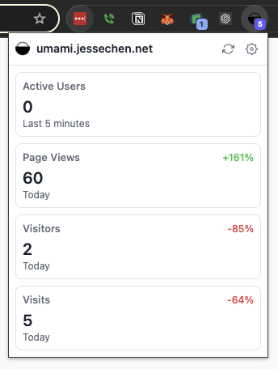
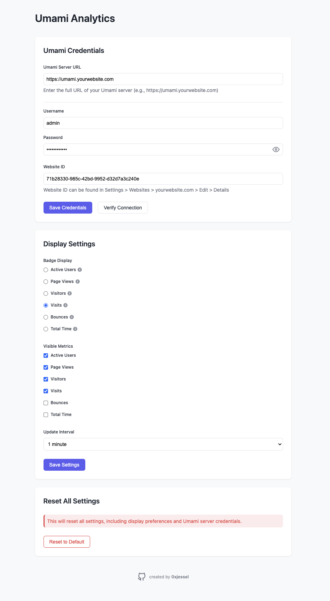

# Umami Analytics Chrome Extension

A Chrome extension that provides real-time analytics from your self-hosted Umami dashboard directly in your browser. Monitor active users, page views, and visitor statistics without leaving your current tab.

## Features

- 🔄 Real-time metrics display with configurable refresh intervals (30 seconds to 30 minutes)
- 👥 Active users counter showing visitors in the last 5 minutes
- 📊 Daily metrics including page views, visitors, visits, bounces, and total time with trend indicators
- 🎯 Customizable browser badge that can display various metrics (active users, page views, visitors, visits, bounces, or total time)
- 🔒 Secure credential storage with authentication token management
- ⚡ Lightweight and performant with optimized API calls
- 🎨 Modern, responsive UI
- 🌐 Compatible with self-hosted Umami servers
- 🔌 Simple setup process with connection verification

## Screenshots

### Extension Popup

See the real-time metrics display showing active users, page views, visitors, and visits with trend indicators:



### Settings Page

Configure your Umami server credentials and display preferences:



## Installation

### Quick Install (Recommended)

1. Visit the [Chrome Web Store](https://chrome.google.com/webstore) _(Coming soon)_
2. Click "Add to Chrome"
3. Follow the configuration steps below to set up your credentials

> **Note:** This extension only supports self-hosted Umami servers. It does not support Umami Cloud.

### Developer Install

1. Clone the repository:

```bash
git clone https://github.com/0xjessel/umami-chrome-extension.git
cd umami-chrome-extension
```

2. Install dependencies:

```bash
npm install
```

3. Build the extension:

```bash
# Build using the optimized build script
./build.sh --clean  # Clean build for development

# For production build with automatic packaging
./build.sh --clean --pack  # Creates a .zip file ready for distribution

# For development with hot reload
npm run dev
```

4. Load in Chrome:
   - Open Chrome and go to `chrome://extensions/`
   - Enable "Developer mode" (top right)
   - Click "Load unpacked"
   - Select the `dist` directory
   - The extension icon should appear in your toolbar

## Configuration

1. Click the extension icon and select "Settings" or right-click and choose "Options"
2. Enter your Umami credentials:
   - Enter your self-hosted Umami server URL
   - Enter your username and password
   - Enter your Website ID (found in website settings)
3. Configure display settings:
   - Choose what metric to show in the extension badge (active users, views, or visitors)
   - Set your preferred update interval
   - Select which metrics to display in the popup

## Development

### Prerequisites

- Node.js (v14 or higher)
- npm (v6 or higher)

### Setup Development Environment

1. Install dependencies:

```bash
npm install
```

2. Start development build with watch mode:

```bash
npm run dev
# or
./build.sh --dev
```

3. Load unpacked extension from the `dist` directory

### Available Scripts

- `./build.sh --clean` - Clean build for development (recommended)
- `./build.sh --clean --pack` - Create production build + zip package for distribution
- `./build.sh --dev` - Development build with optimizations disabled
- `./build.sh --stats` - Generate bundle stats for analysis
- `npm run build` - Production build using npm
- `npm run build:clean` - Clean production build using npm
- `npm run build:pack` - Create zip package for distribution using npm
- `npm run dev` - Development build with watch mode
- `npm run lint` - Lint JavaScript files
- `npm run format` - Format code with Prettier
- `npm test` - Run tests

### Build Script Options

The included `build.sh` script provides several options:

```
Usage: ./build.sh [options]
Options:
  -h, --help     Display help message
  -d, --dev      Build development version (unminified)
  -c, --clean    Clean build (remove dist directory first)
  -p, --pack     Package extension as zip file after building
  -s, --stats    Display webpack bundle stats analysis
```

### Project Structure

```
umami-chrome-extension/
├── manifest.json        # Extension manifest
├── background.js       # Service worker for badge updates
├── popup/             # Extension popup UI
│   ├── popup.html     # Popup layout and structure
│   ├── popup.js      # Real-time metrics display logic
│   └── popup.css     # Popup styling with dark mode
├── options/          # Settings page
│   ├── options.html  # Settings form layout
│   ├── options.js    # Credentials and display settings
│   └── options.css   # Settings page styling
├── src/             # Shared code
│   ├── api.js       # Umami API client for self-hosted servers
│   ├── storage.js   # Chrome storage manager for settings
│   └── constants.js # Shared constants and configurations
└── tests/          # Test suite
    └── api.test.js  # API client tests
```

## Security

- Credentials are stored securely using Chrome's Storage API with encryption
- All API requests are made over HTTPS with proper error handling
- Authentication tokens are never exposed in logs or error messages
- Connection verification before saving credentials
- Automatic token refresh for expired authentication
- Regular security audits of dependencies

## Privacy

This extension is designed with privacy in mind:

- Only accesses analytics data from your configured Umami dashboard
- Communicates exclusively with your specified self-hosted Umami server
- No tracking of browsing history or behavior
- No collection of personal information
- No third-party analytics or tracking
- All data stays between the extension and your Umami server
- Badge and popup only show aggregate statistics
- Credentials are stored locally and never shared

## License

This project is licensed under the MIT License - see the [LICENSE](LICENSE) file for details.

## Acknowledgments

- [Umami](https://umami.is/) - The awesome open source analytics platform that inspired this extension. Umami is a simple, privacy-focused alternative to Google Analytics that respects user privacy and provides powerful analytics capabilities without compromising user data.
- [Chrome Extension Developer Guide](https://developer.chrome.com/docs/extensions/mv3/)

This extension is not officially affiliated with Umami but was built with appreciation for their open-source analytics solution.

## Troubleshooting

### Common Issues

1. **Failed to initialize API**

   - Verify your server URL is correct and includes the protocol (http:// or https://)
   - Check your username and password
   - Ensure your Website ID is correct

2. **Badge not updating**

   - Check if your credentials are still valid
   - Try clicking the refresh button in the popup
   - Verify your polling interval settings

3. **Extension showing no data**

   - Confirm you have active traffic on your website
   - Check if your Umami server is collecting data properly
   - Try reopening the popup

4. **Extension size is large when loading unpacked**
   - Make sure to load ONLY the `dist` directory when using "Load unpacked"
   - The full project directory includes development dependencies that are not needed for the extension
   - Use `./build.sh --clean` before loading the extension
